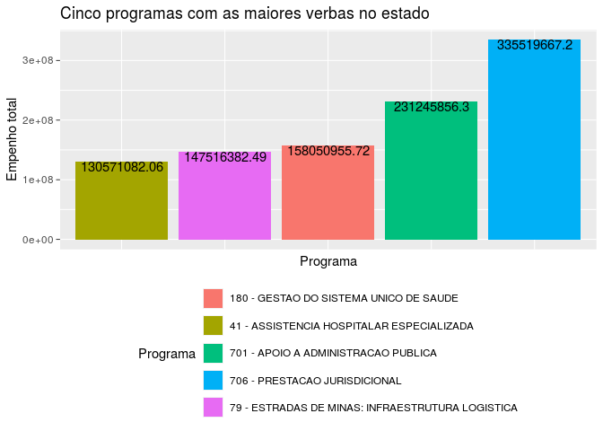
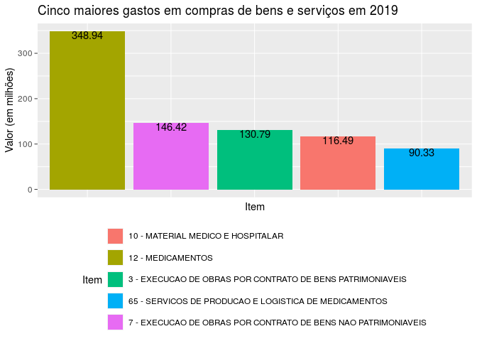
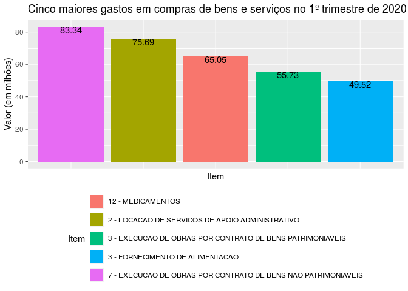
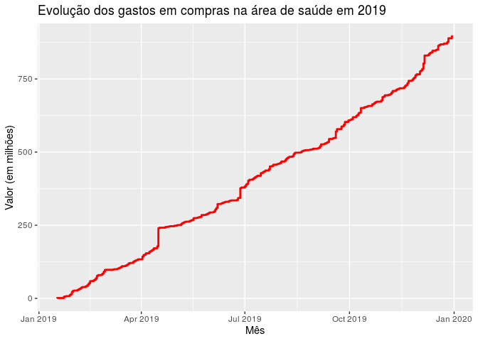
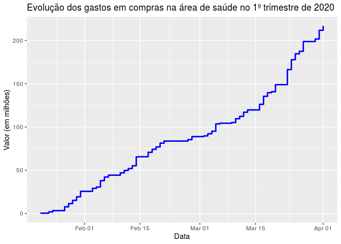

---
output:
  pdf_document: default
  html_document: default
---
Trabalho final
================
Grupo 6
15/07/2020

A base de dados escolhida para o trabalho, disponível nesse
[link](http://www.transparencia.dadosabertos.mg.gov.br/dataset/compras-contratos-do-estado-de-minas-gerais),
apresenta os dados de compras e aquisições de materiais, bens e serviços
pelo Estado de Minas Gerais.

Perguntas:

1)  Quais foram os órgãos que tiveram maior gasto com essas compras?

2)  Lista dos programas que receberam maior verba e como isso se
    relaciona com o programa de governo atual.

3)  Como foi distribuído o gasto no programa que recebeu maior verba e
    no que recebeu menor verba.

4)  O valor total e média mensal de gastos dos 3 poderes em 2019 e 2020.

5)  O valor total e média mensal de gastos das 3 ou 5 unidades
    executores que tem os maiores gastos.

6)  Analisando as compras realizadas em 2019 e 2020, quais foram os bens
    e serviços que apresentaram os maiores gastos?

7)  Qual a evolução dos gastos em compras na área de saúde considerando
    os anos de 2019 e 2020?

8)  Comparação das despesas correntes e despesas de capital

9)  Evolução comparativa dos gastos das unidades orçamentárias

4\_ O gráfico abaixo apresenta a evolução mensal dos gastos da
totalidade dos órgãos dos poderes Executivo, Legislativo e Judiciário.

<!-- -->

Ao analisar o gráfico e o banco de dados, foi possível perceber,
primeiramente, que há uma vacância de dados das compras realizadas pela
Assembléia Legislativa de Minas Gerais (ALMG) em 2019. Como esses dados
estão ausentes, e sendo a ALMG o único órgão que possui gastos no poder
Legislativo, as informações sobre este poder se mostram inconclusivas
durante o ano de 2019.

Por outro lado, é possível perceber, como já podia se esperar, que os
gastos do poder Executivo excedem muito aos gastos dos outros dois
poderes. Isso ocorre pelo fato do Poder Executivo ser reponsável pelos
gastos com políticas públicas em todas áreas, como segurança, saúde,
educação, trasnporte, infraestrutura e etc.

Na tabela abaixo podemos verificar o valor total (em milhões de reais)
gasto pelos três poderes no período analisado, de janeiro de 2019 até
março de 2020, bem como a média mensal dos seus gastos (lembrando que os
dados de 2019 dos gastos do poder Legislativo estão ausentes).

| Poder       | Gasto\_total | Media\_mensal |
| :---------- | -----------: | ------------: |
| Executivo   |   2464.14198 |    164.276132 |
| Judiciario  |    336.04589 |     22.403059 |
| Legislativo |     38.84253 |      2.589502 |

5\_ A tabela abaixo apresenta as cinco unidades executoras que
apresentaram os maiores gastos totais durante o período analisado,
exibindo os valores dos seus gastos totais e a média mensal, ambos em
reais.

| unidade\_executora            | gasto\_total\_unidade | media\_mensal |
| :---------------------------- | --------------------: | ------------: |
| TJMG                          |             335519667 |      22367978 |
| NAJS                          |             183794847 |      12252990 |
| Diretoria de Manutenção - DER |             183690482 |      12246032 |
| SUBPAS - SAF                  |             137289403 |       9152627 |
| FUNED                         |             132338212 |       8822547 |

Apesar do poder Executivo apresentar gastos muito superiores ao do poder
Judiciário, a tabela acima traz um órgão do Judiciário como o que mais
gasta em compras públicas. Isso occorre pois, ao contrário do Executivo,
que possui inúmeros órgãos executando suas políticas públicas, o
Judiciário aqui é composto exclusivamente pelo Tribunal de Justiça de
Minas Gerais (TJMG). Dessa forma, o TJMG, como único compontente do
poder Judiciário, apresenta gastos superiores a qualquer órgão do
Executivo (lembrando da ausência dos dados da ALMG nessa análise).

Em seguida, podemos verificar que os órgãos executores que ocupam da 2ª
à 4ª posição pertencem ao poder Executivo, representando os 4 órgãos
que mais gastam em compras desse poder. O primeiro deles (2º lugar
geral) é o Nucleo de Atendimento À Judicialização da Saúde, enquanto o
terceiro (4º lugar geral) é a Subsecretaria de Políticas e Ações de
Saúde referente às compras de medicamentos para a população. Esse é um
fator importante que destaca como a judicialização da saúde representa
um fator muito oneroso para a administração pública do Estado de Minas
Gerais, como foi estudado mais a fundo na disciplina de Direito
Administrativo. Esse fator se refere às inúmeras ações judiciárias
sofridas pelo Estado para o fornecimento de medicamentos para os
cidadãos, que não são contemplados pelo SUS. [saiba
mais](http://www.mpdft.mp.br/saude/images/judicializacao/Judicializacao_acesso_medicamentos_MG.pdf).

Já o 3º lugar geral pertence á diretoria de manutenção do Departamento
de Estradas e Rodagem de Minas Gerais, o que é algo esperado pelos
gastos elevados em manutenção da infraestrutura viária do Estado. Por
último, a Fundação Ezequiel Dias, que visa participar do fortalecimento
do Sistema Único de Saúde, protegendo e promovendo a saúde, completando
3 das 4 unidades com maiores gastos do Executivo pertencendo, de alguma
forma, ao setor de saúde.

8)  O gráfico abaixo compara os valores empenhados referentes a despesas
    correntes e despesas de capitais.

<!-- -->

A pergunta 8 é respondida pela análise da figura do chamado gráfico de
pizza. Buscou-se por meio dessa visualização comparar as despesas
correntes e as despesas de capital, confrontando-as por meio da
visualização em faixas no gráfico. Nota-se que as despesas correntes são
bem superiores as despesas de capital, o que era de se esperar tendo em
vista a natureza e utilização de cada uma. Não houve dificuldades no
tratamento dos dados nem surpresas na visualização, sendo o resultado
final muito parecido com o esperado inicialmente.

9)  O gráfico de linha abaixo apresenta a comparação das despesas
    empenhadas por 12 das unidades orçamentárias no período analisado de
    2019 a 2020 que mais empenharam.

<!-- -->
Inicialmente, pensou-se em comparar as despesas das unidades
orçamentárias por meio do gráfico de área, no qual seria possível
observar a evolução das despesas a depender do tamanho da área colorida
daquela unidade. Contudo, diversos problemas surgiram com essa
visualização. A primeira delas é a enorme quantidade de unidades, o que
tornou a visualização muito confusa. Em segundo lugar, o fato das
despesas não serem continuas, ou seja, as unidades orçamentárias não
empenham despesas todos os dias. Por fim, os valores são muito distintos
uns dos outros, tendo valores de pouco reais e outros valores na
proporção de milhões de reais. Tudo isso distorceu o gráfico e o
tornou inviável.

Nesse sentido, para resolver o problema, filtrou-se as unidades
orçamentárias pelas 12 que mais empenharam ao longo do período
2019/2020 analisado. Ademais, utilizou-se a visualização por pontos e o
faceting (facet\_wrap) para separar as unidades e poder comparar a
evolução de suas despesas ao longo do tempo. As unidades foram
ordenadas das que mais empenharam no período para as que menos
empenharam.

<!-- -->
Nota-se pelo primeiro gráfico de faceting que o Fundo Estadual de Saúde
é o que mais empenhou no período. Contudo, é importante ressaltar que a
grande maioria dos empenhos são menores que R$1.000.000,00 para todas as
unidades, mas esse fundo em especial possui uma maior quantidade de
empenhos acima desse valor, o que corrobora para ser o que mais empenhou
no período.

Dessa forma, para melhor visualizar os gastos, foi-se limitando o valor
máximo do empenho no eixo das ordenadas do gráfico. Dessa forma, fez-se
limitações de até R$1.000.000,00, até R$125.000,00 e até R$40.000,00.
Por meio dessa limitação, foi possível avaliar melhor a quantidade de
empenhos de cada unidade, verificar qual possui uma maior densidade de
empenhos ao longo do período, se esses empenhos se deram bem
distribuídos ao longo do período ou concentrado em uma determinada
faixa.

<!-- -->

<!-- -->

<!-- -->
